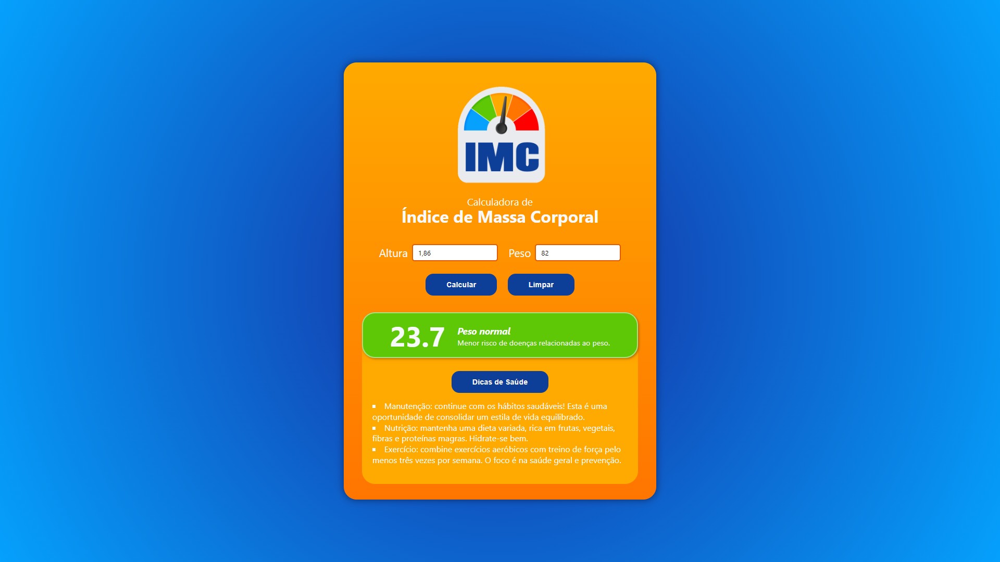

<p align="center">
  
</p>

<p align="center"> <a href="#funcionalidades">Funcionalidades</a> • <a href="#demonstração">Demonstração</a> • <a href="#estrutura-do-projeto">Estrutura do Projeto</a> • <a href="#como-executar">Como Executar</a> • <a href="#tecnologias">Tecnologias</a> • <a href="#autoria">Autoria</a> </p><br>

<h1 align="center">Calculadora de Índice de Massa Corporal (IMC)</h1>

Esta é uma calculadora de Índice de Massa Corporal (IMC) desenvolvida em React como projeto de aprendizado dos conceitos fundamentais da biblioteca. A aplicação permite calcular o IMC e classificar o resultado conforme os padrões da Organização Mundial da Saúde.

## Funcionalidades

- **Cálculo de IMC**: calcula o índice baseado no peso e altura;
- **Suporte a múltiplas unidades**: permite entrada de altura em metros ou centímetros;
- **Classificação automática**: mostra a categoria do IMC;
- **Dicas de saúde**: de acordo com sua categoria, sugere dicas de exercícios e nutrição;
- **Feedback visual**: cores diferentes para cada classificação de IMC.

## Demonstração

<p align="center">
  
  <em>App</em>
</p>
<p align="center">
  
  <em>Classificação</em>
</p>
<p align="center">
  
  <em>Dicas de saúde</em>
</p>

## Estrutura do projeto

```Text
src/
|—— assets/
|   |—— data/
|   |   └── classification.jsx
|   └── images/
|       └── logo.png
|—— components/
|   |—— content/
|   |   |—— Classification.jsx
|   |   |—— Form.jsx
|   |   |—— HealthTips.jsx
|   |   └── Result.jsx
|   └── ui/
|       |—— Button.jsx
|       |—— Header.jsx
|       └── Input.jsx
|—— utils/
|   └── helpers.jsx
|—— App.jsx
|—— main.css
|—— main.jsx
```

## Como executar

```Bash
# Clone o repositório
$ git clone https://github.com/TiLourinho/bmi-calc.git

# Acesse a pasta do projeto
$ cd bmi-calc

# Instale as dependências
$ npm install

# Execute a aplicação
$ npm run dev

# No navegador
http://localhost:5173/
```

## Tecnologias

- [HTML5](https://developer.mozilla.org/en-US/docs/Web/HTML): estrutura da aplicação;
- [CSS3](https://developer.mozilla.org/en-US/docs/Web/CSS): estilização da aplicação;
- [React](https://react.dev/): biblioteca JavaScript para interface do usuário;
- [Vite](https://vite.dev/): ferramenta de build e desenvolvimento frontend.

## Autoria

Tiago Lourinho

[](https://www.linkedin.com/in/lourinho-tiago/)
[](mailto:lourinho.tiago@gmail.com)
