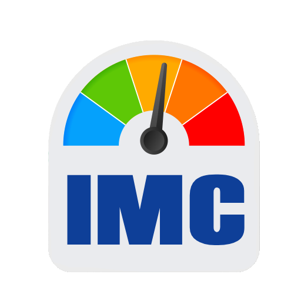

  

<h1 align="center">Calculadora de Índice de Massa Corporal (IMC)</h1>

## Sobre

Esta é uma calculadora de Índice de Massa Corporal (IMC) desenvolvida em React como projeto de aprendizado dos conceitos fundamentais da biblioteca. A aplicação permite calcular o IMC e classificar o resultado conforme os padrões da Organização Mundial da Saúde.

## Desenvolvimento

### Fase 1: Configuração do ambiente

1. Criar novo projeto React utilizando Vite;
2. Limpar arquivos desnecessários do template inicial.

### Fase 2: Estrutura de pastas

1. Planejar a estrutura de arquivos antes de começar a codar.

### Fase 3: Componente App

1. Criar o esqueleto do componente App;
2. Definir os estados necessários (peso, altura, resultado);
3. Planejar a passagem de props entre componentes.

### Fase 4: Componente de Formulário

1. Planejar a passagem de props entre componentes;
2. Adicionar labels para cada campo;
3. Implementar validação básica (números positivos);
4. Permitir que usuário escolha entre metros ou centímetros.

### Fase 5: Lógica de Cálculo

1. Implementar função para calcular IMC;
2. Criar função para converter unidades se necessário;
3. Adicionar tratamento para entradas inválidas.

### Fase 6: Componente de Resultado

1. Criar componente para exibir o valor do IMC;
2. Mostrar a classificação conforme tabela padrão;
3. Adicionar cores diferentes para cada classificação.

### Fase 7: Componente de Classificação

1. Criar função que retorna a classificação baseada no IMC;
2. Definir faixas (abaixo do peso, normal, sobrepeso, etc.);
3. Adicionar mensagens explicativas para cada faixa.

### Fase 8: Estilização

1. Adicionar CSS para melhorar a aparência;
2. Deixar a interface responsiva;
3. Usar cores intuitivas para as classificações;
4. Melhorar a experiência do usuário com feedback visual.

### Fase 9: Melhorias adicionais

1. Adicionar histórico de cálculos;
2. Implementar gráfico de progresso;
3. Adicionar modo escuro/claro;
4. Incluir dicas de saúde baseadas no resultado.

---
